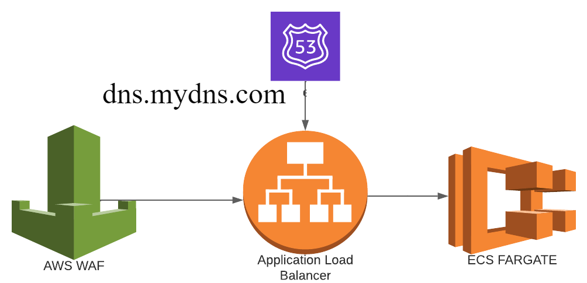

# AWS VPC Terraform module
AWS Terraform modules create VPC resources on AWS and run an Apache web server.
This project was created with Terraform 1.3 and is based on the ECS FARGATE with the specified arguments.

# Usage

## ECS FARGATE infrastructure



### Module

```hcl
module "fargate-infrastructure" {
  source      = "enriquecs095/fargate-infrastructure/aws"
  version     = "4.34.0"
  name        = "fargate"
  environment = "environment_name"
  providers = {
    aws = aws.main_region
  }
 ecs_fargate = {
    ecs_cluster_name = "ecs_main_cluster_1"
    ecs_service = {
      name          = "ecs_service_1"
      desired_count = 2
      launch_type   = "FARGATE"
      network_configuration = {
        security_groups  = ["sg_fargate_1"]
        subnets          = ["subnet_1", "subnet_2"]
        assign_public_ip = true
      }
      load_balancer = {
        container_name = "node_app_1"
        container_port = "80"
      }
    }
    task_definition = {
      name                     = "fargate_1"
      family                   = "node_app_1"
      network_mode             = "awsvpc"
      requires_compatibilities = ["FARGATE"]
      cpu                      = 1024
      memory                   = 4096
      container_definitions = {
        image       = "httpd"
        cpu         = 1024
        memory      = 4096
        name        = "node_app_1"
        networkMode = "awsvpc"
        portMappings = {
          containerPort = 80
          hostPort      = 80
        }
      }
    }
  }

  vpc = {
    cidr_block   = "10.1.0.0/16"
    dns_support  = true
    dns_hostname = true
  }
  subnets = [
    {
      name              = "subnet_1"
      availability_zone = "us-east-1a"
      cidr_block        = "10.1.1.0/24"
    },
    {
      name              = "subnet_2"
      availability_zone = "us-east-1b"
      cidr_block        = "10.1.2.0/24"
    }
  ]
  security_groups = [
    {
      name        = "sg_load_balancer_1"
      description = "Security group for load balancer"
      list_of_rules = [
        {
          name        = "ingress_rule_1"
          description = "Allow inbound trafic from anywhere"
          protocol    = "-1"
          from_port   = 0
          to_port     = 0
          cidr_blocks = ["0.0.0.0/0"]
          type        = "ingress"
        },
        {
          name        = "egress_rule_3"
          description = "Allow outbound trafic to anywhere"
          protocol    = "-1"
          from_port   = 0
          to_port     = 0
          cidr_blocks = ["0.0.0.0/0"]
          type        = "egress"
        }
      ]
    },
    {
      name        = "sg_fargate_1"
      description = "Security group for instances"
      list_of_rules = [
        {
          name        = "ingress_rule_2"
          description = "Allow inbound trafic from anywhere"
          protocol    = "-1"
          from_port   = 0
          to_port     = 0
          cidr_blocks = ["0.0.0.0/0"]
          type        = "ingress"
        },
        {
          name        = "egress_rule_4"
          description = "Allow outbound trafic to anywhere"
          protocol    = "-1"
          from_port   = 0
          to_port     = 0
          cidr_blocks = ["0.0.0.0/0"]
          type        = "egress"
        }
      ]
    },
  ]
  load_balancer = {
    name               = "lb-1"
    internal           = false
    load_balancer_type = "application"
    subnets = [
      "subnet_1",
      "subnet_2"
    ]
    security_groups = [
      "sg_load_balancer_1"
    ]
    lb_target_group = {
      name        = "tg-1"
      port        = "80"
      vpc_id      = "vpc_1"
      protocol    = "HTTP"
      target_type = "ip"
      health_check = {
        enable   = true
        path     = "/"
        interval = 10
        port     = 80
        protocol = "HTTP"
        matcher  = "200-299"
      }
    }
    lb_listener = [
      {
        name                = "lb_l_1"
        port                = "80"
        protocol            = "HTTP"
        default_action_type = "redirect"
        target_group_arn    = null
        ssl_policy          = null
        certificate_arn     = null
        redirect = [
          {
            status_code = "HTTP_301"
            port        = 443
            protocol    = "HTTPS"
          }
        ]
      },
      {
        name                = "lb_l_2"
        port                = "443"
        protocol            = "HTTPS"
        default_action_type = "forward"
        target_group_arn    = "tg-1"
        ssl_policy          = "ELBSecurityPolicy-2016-08"
        certificate_arn     = "acm_1"
        redirect            = []
      },

    ]
  }

  acm_certificate = {
    name                   = "acm_1"
    dns_name               = "mydnsname.com."
    validation_method      = "DNS"
    route53_record_type    = "A"
    ttl                    = 60
    evaluate_target_health = true
  }

  waf = {
    ip_set = {
      name = "ipset_1"
    }
    waf_rule = {
      name        = "wafrule1"
      metric_name = "wafrule1"
      negated     = false
      type        = "IPMatch"
    }
    waf_acl = {
      name           = "wafacl1"
      metric_name    = "wafacl1"
      default_action = "ALLOW"
      type           = "BLOCK"
      priority       = 1
    }
  }

  devops_name  = "DevOps"
  project_name = "fargate_project"

}
```
### Output file

```hcl
output "alb_dns_name_ecs_fargate" {
  description = "The DNS name of the application load balancer"
  value       = module.fargate-infrastructure.alb_dns_name_ecs_fargate
}

output "url_ecs_fargate" {
  description = "The url of the dns server for the ECS Fargate tasks"
  value       =  module.fargate-infrastructure.url_ecs_fargate
}
```
### Configuration file 

```hcl
terraform {
    required_version = ">=0.12.0"
}

provider "aws" {
    region = "us-east-1"
    alias = "main_region"
}
```

If you want to store the terraform.tfstate file remotely on the S3 bucket, replace the previous terraform configuration and paste the following:

```hcl
terraform {
    required_version = ">=0.12.0"
    backend "s3" {
        region= "us-east-1"
    }
}

provider "aws" {
    region = "us-east-1"
    alias = "main_region"
}

```
# Stand up the infrastructure

Follow steps #1, #7, and #8 if you want to create an S3 bucket on AWS to store the terraform state file remotely.

## 1. Create a bucket

Run the following command and change the parameter "bucket-name" for the name of the bucket you want to create:

    aws s3api create-bucket --bucket bucket-name 

## 2. Terraform init

Run the following command in the project directory and change the parameters values:

    terraform init -backend-config="bucket=my_bucket_name" -backend-config="key=environment_name/filename" 

### Optionally If you don't want to store the terraform state file on AWS S3 bucket, run the following command:

    terraform init

## 3. Terraform plan

After run the previous command, run the following command:

    terraform plan 

## 4. Terraform apply 

Finally run the command below:

    terraform apply

    and then write "yes" to confirm the action

### If you want to runs it automatically:

    terraform apply -auto-approve

## 5. Terraform destroy

The following command will destroy the resources:

    terraform destroy

    and then write "yes" to confirm the action

### If you want to runs it automatically:

    terraform destroy -auto-approve

## 6. Removing the working directory

Run the following command for deleting the ".terraform" directory and ".terraform.lock.hcl" file:

    rm -r .terraform/ .terraform.lock.hcl

## 7.Emptying the bucket

The following rm command removes objects that have the key name prefix doc, for example, doc/doc1 and doc/doc2:

    aws s3 rm s3://bucket-name/doc --recursive 

Use the following command to remove all objects without specifying a prefix:

    aws s3 rm s3://bucket-name --recursive 

## 8. Deleting the bucket

Run the following command and change the parameter "bucket_name" for the name of the bucket you want to delete:

    aws s3api delete-bucket --bucket bucket-name 

## Documentation

- [Terraform Backend Configuration](https://www.terraform.io/language/settings/backends/configuration)
- [Creating AWS Bucket Resource](https://docs.aws.amazon.com/AmazonS3/latest/userguide/create-bucket-overview.html)
- [Emptying AWS Bucket Resource](https://docs.aws.amazon.com/AmazonS3/latest/userguide/empty-bucket.html)
- [Deleting AWS Bucket Resource](https://docs.aws.amazon.com/AmazonS3/latest/userguide/delete-bucket.html)